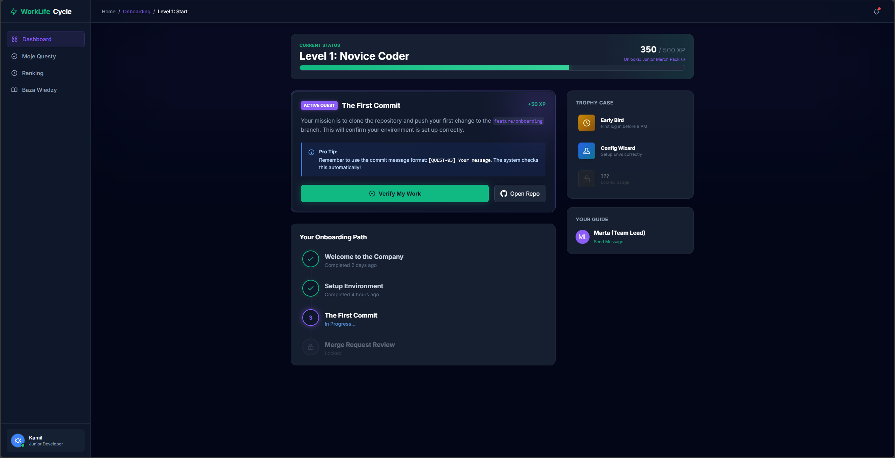
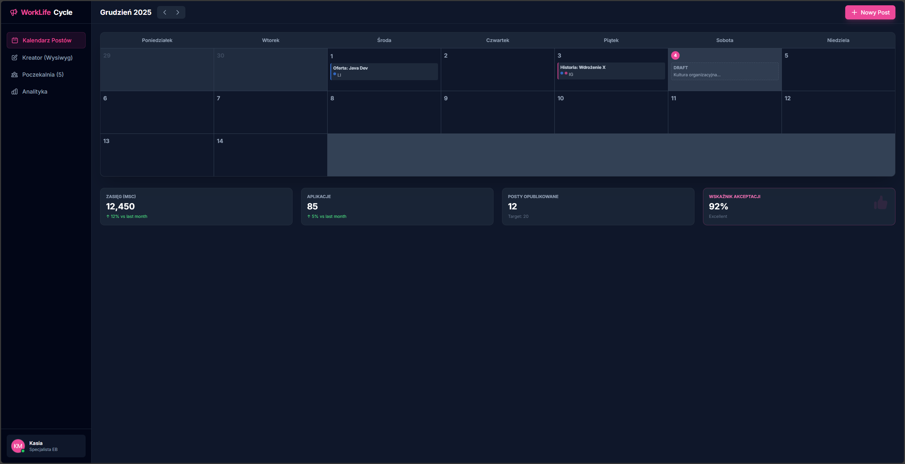

# Specyfikacja Wymagań Oprogramowania (SRS)
## System Zarządzania Cyklem Życia Pracownika: Strategie Rekrutacji i Rozwoju
**Autorzy:** Jan Piaskowy, Piotr Gębalski, Mateusz Cholewa

---

## Spis Treści
1.  [Wstęp](#1-wstęp)
2.  [Opis Ogólny](#2-opis-ogólny)
3.  [Wymagania Dotyczące Interfejsów Zewnętrznych](#3-wymagania-dotyczące-interfejsów-zewnętrznych)
4.  [Wymagania Funkcjonalne](#4-wymagania-funkcjonalne)
5.  [Atrybuty Jakościowe (Wymagania Niefunkcjonalne)](#5-atrybuty-jakościowe-wymagania-niefunkcjonalne)
6.  [Odkrywanie i Analiza Wymagań](#6-odkrywanie-i-analiza-wymagań)
7.  [Dodatki](#7-dodatki)

---

## 1. Wstęp

### 1.1. Cel Dokumentu
Celem niniejszego dokumentu Specyfikacji Wymagań Oprogramowania (SRS) jest szczegółowe zdefiniowanie wymagań funkcjonalnych i niefunkcjonalnych dla zintegrowanej platformy informatycznej wspierającej zarządzanie cyklem życia pracownika (Employee Lifecycle Management). System ten, roboczo nazwany "WorkLife Cycle Platform", ma na celu zintegrowanie procesów przyciągania talentów (Employer Branding) z ich efektywnym wdrożeniem i rozwojem (Onboarding).

Dokument ten jest przeznaczony dla:
*   **Zespołu Deweloperskiego:** Jako techniczna mapa drogowa implementacji, definiująca zachowanie systemu, interfejsy i ograniczenia.
*   **Interesariuszy Biznesowych (Zarząd, HR):** W celu weryfikacji, czy zaproponowane rozwiązanie realizuje cele biznesowe organizacji i rozwiązuje zidentyfikowane problemy.
*   **Testerów:** Jako podstawa do tworzenia planów testów, scenariuszy testowych i kryteriów akceptacji.

Dokument stanowi formalny kontrakt między zespołem realizującym a zlecającym, precyzując zakres prac (Scope of Work).

### 1.2. Wizja, Zakres i Cele Produktu

#### 1.2.1. Kontekst Biznesowy i Problem
Współczesne średnie i duże organizacje technologiczne borykają się z dwoma fundamentalnymi problemami, które są ze sobą ściśle powiązane:
1.  **Niespójny Employer Branding:** Działy HR mają trudności z regularnym publikowaniem treści w mediach społecznościowych. Publikacje są chaotyczne (2-3 posty/miesiąc), tworzenie contentu jest czasochłonne (45-90 min/post), a potencjał tkwiący w historiach sukcesu pracowników jest marnowany. Skutkuje to niskim zasięgiem organicznym i wysokim kosztem pozyskania kandydata.
2.  **Nieefektywny Onboarding:** Po zatrudnieniu kandydata, proces wdrożenia jest często niesformalizowany. Materiały są rozproszone (wiki, maile, ustne przekazy), mentorzy tracą czas na powtarzalne czynności, a firma nie posiada danych o rzeczywistym czasie osiągnięcia produktywności (Time-to-Productivity). Prowadzi to do frustracji nowych pracowników i ich szybszej rotacji.

#### 1.2.2. Wizja Produktu
Naszą wizją jest stworzenie **"WorkLife Cycle Platform"** – spójnego ekosystemu, który:
*   **Automatyzuje Employer Branding:** "Czyni każdą firmę ekspertem w employer brandingu", zamieniając zapomniane sukcesy zespołów i oferty pracy w angażujący content w social media przy minimalnym udziale człowieka.
*   **Grywalizuje Onboarding:** Zapewnia nowym pracownikom interaktywną, mierzalną ścieżkę wdrożenia (w formie "Guestów"), która integruje się bezpośrednio z ich środowiskiem pracy (repozytoria kodu), skracając czas do pełnej produktywności.

#### 1.2.3. Zakres Systemu
System będzie aplikacją webową składającą się z dwóch zintegrowanych modułów:
1.  **Moduł Employer Branding:**
    *   Automatyczne generowanie treści postów na podstawie ofert pracy i wsadów od pracowników.
    *   Inteligentny harmonogram publikacji (Scheduler) na platformy LinkedIn, Facebook, Instagram.
    *   Centralny dashboard analityczny zasięgów i konwersji.
2.  **Moduł Onboarding & Development:**
    *   Kreator ścieżek onboardingowych dla różnych ról (np. Backend Dev, Frontend Dev).
    *   System "Questów" (zadań) z postępem wizualnym (Pasek postępu, Odznaki).
    *   Integracja z systemami kontroli wersji (GitHub/GitLab) w celu automatycznej weryfikacji zadań technicznych.
    *   Panel raportowy dla HR i Liderów (metryki TtP, satysfakcja).

#### 1.2.4. Poza Zakresem (Out of Scope)
*   System nie będzie zastępował pełnego systemu ATS (Applicant Tracking System) do zarządzania procesem rekrutacji kandydatów.
*   W wersji MVP nie przewiduje się natywnej aplikacji mobilnej (tylko RWD Web).
*   System nie będzie obsługiwał naliczania płac ani formalnych aspektów kadrowych (umowy).

#### 1.2.5. Główne Cele Biznesowe (SMART)
Zidentyfikowano następujące kluczowe wskaźniki efektywności (KPIs), które system musi zrealizować:

*   **KPI-01 (Zasięg):** Wzrost organicznego zasięgu treści employer brandingowych o **50%** (z bazowego 8,000 do 12,000+ wyświetleń miesięcznie) w ciągu 6 miesięcy od wdrożenia, poprzez zwiększenie wolumenu publikacji do 15-20 postów/miesiąc.
*   **KPI-02 (Efektywność HR):** Redukcja czasu pracy zespołu HR poświęcanego na tworzenie contentu social media z **4 godzin do 30 minut miesięcznie**.
*   **KPI-03 (Time-to-Productivity):** Skrócenie średniego czasu wdrożenia nowego pracownika IT (osiągnięcie pełnej samodzielności) z **90 dni do 21 dni (3 tygodni)** dla 80% zatrudnionych.
*   **KPI-04 (Retencja):** Wzrost wskaźnika ukończenia procesu onboardingu w terminie do **85%**.

### 1.3. Definicje, Akronimy i Skróty
Aby zapewnić jednoznaczne zrozumienie dokumentu, wprowadza się następujące definicje:

*   **TtP (Time-to-Productivity):** Metryka określająca czas od pierwszego dnia pracy pracownika do momentu, w którym osiąga on oczekiwany poziom wydajności (np. samodzielnie realizuje zadania z backlogu).
*   **EB (Employer Branding):** Zespół działań mających na celu budowanie wizerunku pracodawcy jako "pracodawcy z wyboru".
*   **Quest:** Pojedyncze zadanie w procesie onboardingu, sformatowane w języku grywalizacji, posiadające cel, opis i nagrodę (XP).
*   **XP (Experience Points):** Punkty doświadczenia przyznawane pracownikowi za realizację zadań w systemie.
*   **MVP (Minimum Viable Product):** Wersja produktu z minimalnym zestawem cech wystarczającym do zadowolenia wczesnych klientów i zebrania informacji zwrotnych.
*   **ATS (Applicant Tracking System):** System do śledzenia aplikacji kandydatów.
*   **SaaS (Software as a Service):** Model udostępniania oprogramowania w chmurze.

### 1.4. Przegląd Dokumentu
*   **Rozdział 2** opisuje ogólną charakterystykę systemu, w tym jego funkcje, użytkowników i ograniczenia.
*   **Rozdział 3** definiuje interfejsy zewnętrzne, w tym UI oraz API.
*   **Rozdział 4** zawiera szczegółowe wymagania funkcjonalne w formie Historyjek Użytkownika (User Stories).
*   **Rozdział 5** określa wymagania niefunkcjonalne (Atrybuty Jakościowe).
*   **Rozdział 6** przedstawia analizę rynku i konkurencji.

## 2. Opis Ogólny

### 2.1. Główne Funkcje Produktu
Architektura systemu jest modułowa. Główne bloki funkcjonalne to:

1.  **Generator Treści (Content Engine):**
    *   Pobieranie danych z ofert pracy (tytuł, opis, wymagania).
    *   Przetwarzanie danych na posty social media (tekst + grafika).
    *   Mechanizm szablonów postów.
2.  **Harmonogram i Publikacja (Scheduler):**
    *   Kalendarz publikacji (widok miesięczny/tygodniowy).
    *   Kolejkowanie postów.
    *   Obsługa błędów API (retry mechanism).
3.  **Silnik Onboardingowy (Gamification Engine):**
    *   Drzewo zadań (ścieżki rozwoju).
    *   System nagród i odznak.
    *   Integratory z zewnętrznymi API (GitHub, GitLab, Jira).
4.  **Analityka i Raportowanie (Dashboard):**
    *   Agregacja danych z social media (API Facebook/LinkedIn).
    *   wizualizacja postępów pracowników (wykresy burndown, paski postępu).

### 2.2. Klasy Użytkowników i Persony
Zidentyfikowano trzy główne grupy użytkowników oraz przygotowano dla nich szczegółowe persony.

#### 2.2.1. Klasa: Dział HR / Rekrutacja
Użytkownicy odpowiedzialni za wizerunek firmy i procesy kadrowe.
*   **Persona:** Kasia, Specjalista ds. Employer Brandingu (29 lat).
    *   *Kontekst:* Pracuje w średniej firmie IT (300 os.). Jest kreatywna, ale przeciążona pracą operacyjną.
    *   *Ból:* "Mam świetne historie od ludzi, ale nie mam czasu ich spisać i opublikować. Robienie grafik zajmuje wieki."
    *   *Cel:* Zbudować silną markę pracodawcy przy minimalnym wysiłku manualnym.
*   **Persona:** Piotr, Specjalista HR (39 lat).
    *   *Kontekst:* Odpowiada za procesy twarde i miękkie. Analityczny umysł.
    *   *Ból:* Brak twardych danych dla zarządu. Nie wie, czy onboarding działa, dopóki ktoś się nie zwolni.
    *   *Cel:* Zmierzyć ROI z onboardingu i EB.

#### 2.2.2. Klasa: Liderzy Zespołów Technicznych
Osoby zarządzające zespołami, do których trafiają nowi pracownicy.
*   **Persona:** Marta, Engineering Manager (35 lat).
    *   *Kontekst:* Zarządza zespołem 10 programistów. Skupia się na delivery.
    *   *Ból:* Nowy pracownik zabiera jej 20% czasu w pierwszych tygodniach na te same pytania ("gdzie jest dokumentacja?", "na którym branchu pracujemy?").
    *   *Cel:* Szybko wdrożyć "świeżaka" do robienia ticketów, bez bycia niańką.

#### 2.2.3. Klasa: Pracownicy (Użytkownicy Końcowi)
Osoby przechodzące proces onboardingu.
*   **Persona:** Kamil, Mid Java Developer (27 lat).
    *   *Kontekst:* Zmienił pracę, chce się wykazać.
    *   *Ból:* Chaos w dokumentacji. Nie wie, co ma robić w pierwszym tygodniu. Czuje się zagubiony.
    *   *Cel:* Jak najszybciej zrobić pierwszy commit na produkcję i poczuć się potrzebnym.

### 2.3. Ograniczenia Projektowe i Implementacyjne
Projekt musi zostać zrealizowany przy uwzględnieniu następujących sztywnych ograniczeń:

1.  **Szczegółowe Ograniczenia Technologiczne:**
    *   **Backend:** Preferowany stos technologiczny zgodny z kompetencjami zespołu (np. Python/Django lub Node.js).
    *   **Infrastruktura:** Wdrożenie w chmurze AWS lub Azure (z wykorzystaniem darmowych tierów w fazie MVP).
    *   **Baza Danych:** Relacyjna baza danych (PostgreSQL) do przechowywania danych strukturalnych.
    *   **Integracja Git:** System musi obsługiwać co najmniej jednego głównego providera (GitHub Enterprise).

2.  **Limity Zewnętrzne (API Limits):**
    *   System musi uwzględniać limity publikacji API LinkedIn (ok. 150 postów/dzień na aplikację) oraz wygaśnięcie tokenów autoryzacyjnych (60 dni). Wymagane jest wdrożenie mechanizmu odświeżania tokenów.

3.  **Ograniczenia Prawne (RODO/GDPR):**
    *   Bezwzględny wymóg przechowywania danych osobowych na serwerach w EOG (Frankfurt/Dublin).
    *   Implementacja prawa do bycia zapomnianym (funkcja "Hard Delete" danych kandydata/pracownika).
    *   Wymuszone zbieranie zgód (Consent) pracowników przed publikacją ich wizerunku w module EB.

4.  **Ograniczenia Budżetowe:**
    *   Całkowity miesięczny koszt infrastruktury dla MVP nie może przekroczyć **500 PLN ($120)**. Wymaga to optymalizacji użycia zasobów chmurowych (np. serverless, kontenery spot).

### 2.4. Założenia Projektowe
*   **Z1:** Organizacja posiada subskrypcję Microsoft 365 / Azure AD, która posłuży jako dostawca tożsamości (SSO).
*   **Z2:** Pracownicy techniczni nie będą stawiać oporu przed "grywalizacją" (nie uznają jej za infantylną), pod warunkiem, że zadania będą merytoryczne.
*   **Z3:** LinkedIn pozostanie dominującą platformą dla rekrutacji B2B, a jego API nie ulegnie drastycznym zmianom (Breaking Changes) w ciągu najbliższych 12 miesięcy.

---

## 3. Wymagania Dotyczące Interfejsów Zewnętrznych

### 3.1. Interfejsy Użytkownika (UI)
System musi posiadać nowoczesny, responsywny interfejs webowy.

#### 3.1.1. Koncepcja UI Modułu Onboarding (Widok Pracownika)
*   **Główny Dashboard:** Centralny element to "Ścieżka Rozwoju" wizualizowana jako mapa lub linia czasu z punktami milowymi (Kamienie Milowe).
*   **Panel Zadania:** Po kliknięciu w punkt na mapie, otwiera się modal z opisem zadania, sekcją "Dobre praktyki", linkami do dokumentacji oraz statusem weryfikacji (np. "Oczekiwanie na Commit").
*   **Grywalizacja:** Pasek postępu, licznik punktów XP, wirtualna gablota z odznakami (np. "First Commit", "Bug Hunter").

**Makieta poglądowa (Dashboard Pracownika):**

#### 3.1.2. Koncepcja UI Modułu HR (Widok Administratora)
*   **Content Calendar:** Widok kalendarza (miesięczny) z kafelkami reprezentującymi zaplanowane posty. Obsługa techniki Drag&Drop do przesuwania postów między dniami.
*   **Kreator Posta:** Formularz z podglądem na żywo dla formatów LinkedIn (Desktop/Mobile), Facebook i Instagram.
*   **Centrum Akceptacji:** Lista wsadów od pracowników (Historie Sukcesu) oczekujących na moderację i publikację przez HR.

**Makieta poglądowa (Panel HR - Kalendarz):**

### 3.2. Interfejsy Programowe (API)
Specyfikacja techniczna punktów styku z systemami zewnętrznymi.

#### 3.2.1. Integracja z Repozytoriami (GitHub/GitLab API)
System będzie nasłuchiwał na zdarzenia (Webhooks).
*   **Endpoint:** `POST /api/webhooks/github`
*   **Payload:** Dane JSON zawierające informacje o `push_event`, `pull_request`, `commit_message`, `author_email`.
*   **Logika:** System parsuje wiadomość commita w poszukiwaniu identyfikatora zadania (np. `[QUEST-101]`) i na tej podstawie aktualizuje status w bazie danych.

#### 3.2.2. Integracja z Social Media
*   **LinkedIn API (`/v2/ugcPosts`):** Używane do publikacji treści tekstowych i graficznych na profilach firmowych. Wymaga obsługi protokołu OAuth 2.0.
*   **Facebook Graph API (`/feed`):** Publikacja postów na stronach (Pages).
*   **Instagram Graph API:** Publikacja zdjęć (wymaga specyficznego formatowania obrazów - aspect ratio).

#### 3.2.3. System Powiadomień
*   **Slack/Teams API:** System będzie wysyłał powiadomienia do użytkowników o:
    *   Nowych zadaniach onboardingowych.
    *   Zaliczeniu zadania.
    *   Konieczności akceptacji posta (dla HR).

---

## 4. Wymagania Funkcjonalne

Niniejsza sekcja zawiera kompletny wykaz wymagań funkcjonalnych, zorganizowany według modułów i priorytetyzowany metodą MoSCoW.

### 4.1. Moduł Employer Branding (EB)

#### **[US-EB-01] Automatyczne generowanie postów z ofert pracy**
*   **Priorytet:** Must Have (Krytyczny dla MVP)
*   **Opis:** System jako "Agent" monitoruje listę ofert pracy. Gdy pojawi się nowa oferta, automatycznie generuje szkic posta.
*   **Kryteria Akceptacji (Gherkin):**
    *   **SCENARIUSZ 1: Wykrycie nowej oferty**
        *   **GIVEN** w systemie dodano nową ofertę pracy na stanowisko "Senior DevOps".
        *   **WHEN** proces "Content Generator" uruchamia się (np. co godzinę).
        *   **THEN** w panelu "Propozycje" pojawia się nowy szkic posta.
        *   **AND** szkic zawiera wygenerowany przez AI chwytliwy nagłówek, 3 kluczowe benefity z oferty i link do aplikowania.
    *   **SCENARIUSZ 2: Brak danych w ofercie**
        *   **GIVEN** oferta pracy ma pusty opis.
        *   **THEN** system nie generuje posta i loguje ostrzeżenie dla administratora.

#### **[US-EB-02] Harmonogramowanie i Multi-publikacja**
*   **Priorytet:** Must Have
*   **Opis:** Użytkownik może zaplanować publikację jednego posta na wiele platform (LinkedIn, FB, IG) jednym kliknięciem.
*   **Kryteria Akceptacji:**
    *   **SCENARIUSZ 1: Publikacja natychmiastowa**
        *   **WHEN** użytkownik klika "Publikuj teraz"
        *   **THEN** system wysyła żądania do wybranych API.
        *   **AND** zwraca status "Opublikowano" tylko jeśli wszystkie API odpowiedziały 200 OK.
    *   **SCENARIUSZ 2: Obsługa błędu API (Reliability)**
        *   **GIVEN** API LinkedIn zwraca błąd 503 (Service Unavailable).
        *   **THEN** system oznacza post jako "Błąd publikacji".
        *   **AND** automatycznie ponawia próbę za 5 minut (mechanizm exponential backoff).
        *   **AND** wysyła powiadomienie do użytkownika, jeśli po 3 próbach nadal jest błąd.

#### **[US-EB-03] Import Historii Sukcesu (Employee Advocacy)**
*   **Priorytet:** Should Have
*   **Opis:** Formularz dla pracowników do zgłaszania swoich sukcesów (np. "Zrobiliśmy wdrożenie u klienta X"), które HR może zamienić w post.
*   **Kryteria Akceptacji:**
    *   Pracownik wypełnia prosty formularz (Kto, Co, Zdjęcie).
    *   Zgłoszenie trafia do "Poczekalni" w panelu HR.
    *   HR może jednym kliknięciem "Generuj Post" zamienić zgłoszenie w gotowy draft social media.

### 4.2. Moduł Onboarding (ONB)

#### **[US-ONB-01] Interaktywne Questy Wdrożeniowe**
*   **Priorytet:** Must Have
*   **Opis:** Prezentacja listy zadań w formie grywalizowanej.
*   **Kryteria Akceptacji:**
    *   Widok pracownika pokazuje listę zadań pogrupowaną w etapy (np. "Dzień 1", "Tydzień 1").
    *   Zablokowane etapy (kłódka) są niedostępne dopóki nie ukończy się poprzednich.
    *   Każde zadanie ma: Tytuł, Opis, Liczbę punktów XP, Warunki zaliczenia.

#### **[US-ONB-02] Automatyczna Weryfikacja przez Git (Smart Check)**
*   **Priorytet:** Must Have (Kluczowa innowacja)
*   **Opis:** System zalicza zadania bez ingerencji człowieka, analizując aktywność w kodzie.
*   **Kryteria Akceptacji:**
    *   **SCENARIUSZ 1: Poprawny Commit**
        *   **GIVEN** zadanie wymaga commita z ID w treści wiadomości (np. "Fixes #123").
        *   **WHEN** pracownik wykonuje `git push`.
        *   **THEN** system otrzymuje webhook.
        *   **AND** parsuje wiadomość, znajduje ID.
        *   **AND** oznacza zadanie w systemie jako "Zaliczone".
        *   **AND** wysyła pracownikowi gratulacje na Slacku ("Brawo! Pierwszy kod na produkcji!").
    *   **SCENARIUSZ 2: Błędny Branch**
        *   **GIVEN** zadanie wymaga pracy na branchu `feature/onboarding`.
        *   **WHEN** pracownik pushuje na `main`.
        *   **THEN** system odrzuca zaliczenie i wysyła botem informację: "Pamiętaj o pracy na feature branchach!".

#### **[US-ONB-03] Dashboard Lidera (Monitoring TtP)**
*   **Priorytet:** Should Have
*   **Opis:** Widok dla managera pokazujący, gdzie utknął nowy pracownik.
*   **Kryteria Akceptacji:**
    *   Tabela wszystkich "Onboardees".
    *   Kolumna "Ostatnia aktywność" (np. "2 dni temu").
    *   Alertowanie: Jeśli pracownik nie zrobił postępu przez 3 dni, system podświetla go na czerwono.

#### **[US-ONB-04] Ankiety Satysfakcji (Feedback Loop)**
*   **Priorytet:** Could Have (Dla MVP: prosta ankieta)
*   **Opis:** Po zakończeniu etapu onboardingu pracownik otrzymuje mini-ankietę.
*   **Kryteria Akceptacji:**
    *   Pytanie NPS ("Jak bardzo poleciłbyś ten proces...").
    *   Pytanie otwarte ("Co było najtrudniejsze?").
    *   Wyniki są agregowane w panelu HR.

---
