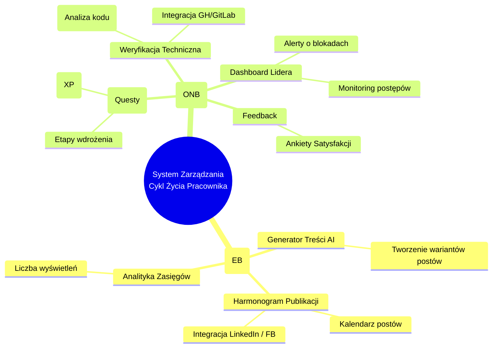
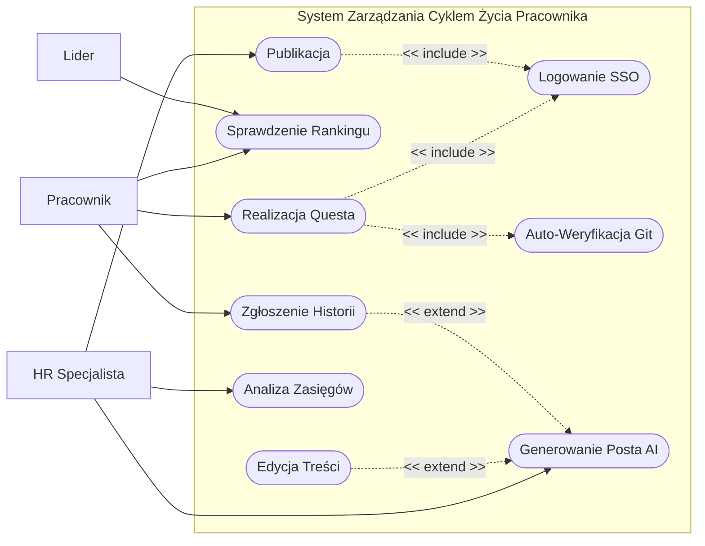

# Specyfikacja Wymagań Oprogramowania (SRS)
## System Zarządzania Cyklem Życia Pracownika: Strategie Rekrutacji i Rozwoju
**Autorzy:** Jan Piaskowy, Piotr Gębalski, Mateusz Cholewa

---

## Spis Treści
1.  [Wstęp](#1-wstęp)
2.  [Opis Ogólny](#2-opis-ogólny)
3.  [Wymagania Dotyczące Interfejsów Zewnętrznych](#3-wymagania-dotyczące-interfejsów-zewnętrznych)
4.  [Wymagania Funkcjonalne](#4-wymagania-funkcjonalne)
5.  [Atrybuty Jakościowe (Wymagania Niefunkcjonalne)](#5-atrybuty-jakościowe-wymagania-niefunkcjonalne)
6.  [Odkrywanie i Analiza Wymagań](#6-odkrywanie-i-analiza-wymagań)
7.  [Dodatki](#7-dodatki)

---

## 1. Wstęp

### 1.1. Cel Dokumentu
Celem niniejszego dokumentu Specyfikacji Wymagań Oprogramowania (SRS) jest szczegółowe zdefiniowanie wymagań funkcjonalnych i niefunkcjonalnych dla zintegrowanej platformy informatycznej wspierającej zarządzanie cyklem życia pracownika (Employee Lifecycle Management).

Dokument dotyczy systemu **"System Zarządzania Cyklem Życia Pracownika" w wersji 1.0 (MVP)**. System ten ma na celu zintegrowanie procesów przyciągania talentów (Employer Branding) z ich efektywnym wdrożeniem i rozwojem (Onboarding).

Dokument ten jest przeznaczony dla:
*   **Zespołu Deweloperskiego:** Jako techniczna mapa drogowa implementacji, definiująca zachowanie systemu, interfejsy i ograniczenia.
*   **Interesariuszy Biznesowych (Zarząd, HR):** W celu weryfikacji, czy zaproponowane rozwiązanie realizuje cele biznesowe organizacji i rozwiązuje zidentyfikowane problemy.
*   **Testerów:** Jako podstawa do tworzenia planów testów, scenariuszy testowych i kryteriów akceptacji.

Dokument stanowi formalny kontrakt między zespołem realizującym a zlecającym, precyzując zakres prac (Scope of Work).

### 1.2. Wizja, Zakres i Cele Produktu

#### 1.2.1. Kontekst Biznesowy i Problem
Współczesne średnie i duże organizacje technologiczne borykają się z dwoma fundamentalnymi problemami, które są ze sobą ściśle powiązane:
1.  **Niespójny Employer Branding:** Działy HR mają trudności z regularnym publikowaniem treści w mediach społecznościowych. Publikacje są chaotyczne (2-3 posty/miesiąc), tworzenie contentu jest czasochłonne (45-90 min/post), a potencjał tkwiący w historiach sukcesu pracowników jest marnowany. Skutkuje to niskim zasięgiem organicznym i wysokim kosztem pozyskania kandydata.
2.  **Nieefektywny Onboarding:** Po zatrudnieniu kandydata, proces wdrożenia jest często niesformalizowany. Materiały są rozproszone (wiki, maile, ustne przekazy), mentorzy tracą czas na powtarzalne czynności, a firma nie posiada danych o rzeczywistym czasie osiągnięcia produktywności (Time-to-Productivity). Prowadzi to do frustracji nowych pracowników i ich szybszej rotacji.

#### 1.2.2. Wizja Produktu
Naszą wizją jest stworzenie **"System Zarządzania Cyklem Życia Pracownika"** – spójnego ekosystemu, który:
*   **Automatyzuje Employer Branding:** "Czyni każdą firmę ekspertem w employer brandingu", zamieniając zapomniane sukcesy zespołów i oferty pracy w angażujący content w social media przy minimalnym udziale człowieka.
*   **Grywalizuje Onboarding:** Zapewnia nowym pracownikom interaktywną, mierzalną ścieżkę wdrożenia (w formie "Guestów"), która integruje się bezpośrednio z ich środowiskiem pracy (repozytoria kodu), skracając czas do pełnej produktywności.

#### 1.2.3. Zakres Systemu
System będzie aplikacją webową składającą się z dwóch zintegrowanych modułów:
1.  **Moduł Employer Branding:**
    *   Automatyczne generowanie treści postów na podstawie ofert pracy i wsadów od pracowników.
    *   Inteligentny harmonogram publikacji (Scheduler) na platformy LinkedIn, Facebook, Instagram.
    *   Centralny dashboard analityczny zasięgów i konwersji.
2.  **Moduł Onboarding & Development:**
    *   Kreator ścieżek onboardingowych dla różnych ról (np. Backend Dev, Frontend Dev).
    *   System "Questów" (zadań) z postępem wizualnym (Pasek postępu, Odznaki).
    *   Integracja z systemami kontroli wersji (GitHub/GitLab) w celu automatycznej weryfikacji zadań technicznych.
    *   Panel raportowy dla HR i Liderów (metryki TtP, satysfakcja).

#### 1.2.4. Poza Zakresem (Out of Scope)
*   System nie będzie zastępował pełnego systemu ATS (Applicant Tracking System) do zarządzania procesem rekrutacji kandydatów.
*   W wersji MVP nie przewiduje się natywnej aplikacji mobilnej (tylko RWD Web).
*   System nie będzie obsługiwał naliczania płac ani formalnych aspektów kadrowych (umowy).

#### 1.2.5. Główne Cele Biznesowe (SMART)
Zidentyfikowano następujące kluczowe wskaźniki efektywności (KPIs), które system musi zrealizować:

*   **KPI-01 (Zasięg):** Wzrost organicznego zasięgu treści employer brandingowych o **50%** (z bazowego 8,000 do 12,000+ wyświetleń miesięcznie) w ciągu 6 miesięcy od wdrożenia, poprzez zwiększenie wolumenu publikacji do 15-20 postów/miesiąc.
*   **KPI-02 (Efektywność HR):** Redukcja czasu pracy zespołu HR poświęcanego na tworzenie contentu social media z **4 godzin do 30 minut miesięcznie**.
*   **KPI-03 (Time-to-Productivity):** Skrócenie średniego czasu wdrożenia nowego pracownika IT (osiągnięcie pełnej samodzielności) z **90 dni do 21 dni (3 tygodni)** dla 80% zatrudnionych.
*   **KPI-04 (Retencja):** Wzrost wskaźnika ukończenia procesu onboardingu w terminie do **85%**.

### 1.3. Definicje, Akronimy i Skróty
Aby zapewnić jednoznaczne zrozumienie dokumentu, wprowadza się następujące definicje:

*   **TtP (Time-to-Productivity):** Metryka określająca czas od pierwszego dnia pracy pracownika do momentu, w którym osiąga on oczekiwany poziom wydajności (np. samodzielnie realizuje zadania z backlogu).
*   **EB (Employer Branding):** Zespół działań mających na celu budowanie wizerunku pracodawcy jako "pracodawcy z wyboru".
*   **ONB (Onboarding):** Proces wdrożenia nowego pracownika obejmujący zadania, materiały szkoleniowe i mechanizmy weryfikacji, których celem jest szybkie osiągnięcie pełnej produktywności (Time-to-Productivity).
*   **Quest:** Pojedyncze zadanie w procesie onboardingu, sformatowane w języku grywalizacji, posiadające cel, opis i nagrodę (XP).
*   **XP (Experience Points):** Punkty doświadczenia przyznawane pracownikowi za realizację zadań w systemie.
*   **MVP (Minimum Viable Product):** Wersja produktu z minimalnym zestawem cech wystarczającym do zadowolenia wczesnych klientów i zebrania informacji zwrotnych.
*   **ATS (Applicant Tracking System):** System do śledzenia aplikacji kandydatów.
*   **SaaS (Software as a Service):** Model udostępniania oprogramowania w chmurze.

### 1.4. Przegląd Dokumentu
*   **Rozdział 2** opisuje ogólną charakterystykę systemu, w tym jego funkcje, użytkowników i ograniczenia.
*   **Rozdział 3** definiuje interfejsy zewnętrzne, w tym UI oraz API.
*   **Rozdział 4** zawiera szczegółowe wymagania funkcjonalne w formie Historyjek Użytkownika (User Stories).
*   **Rozdział 5** określa wymagania niefunkcjonalne (Atrybuty Jakościowe).
*   **Rozdział 6** przedstawia analizę rynku i konkurencji.
*   **Rozdział 7** zawiera dodatkowe informacje, takie jak persony użytkowników i kwestie do rozwiązania.

## 2. Opis Ogólny

### 2.1. Główne Funkcje Produktu
Architektura systemu jest modułowa. Główne bloki funkcjonalne to:

1.  **Generator Treści (Content Engine):**
    *   Pobieranie danych z ofert pracy (tytuł, opis, wymagania).
    *   Przetwarzanie danych na posty social media (tekst + grafika).
    *   Mechanizm szablonów postów.
2.  **Harmonogram i Publikacja (Scheduler):**
    *   Kalendarz publikacji (widok miesięczny/tygodniowy).
    *   Kolejkowanie postów.
    *   Obsługa błędów API (retry mechanism).
3.  **Silnik Onboardingowy (Gamification Engine):**
    *   Drzewo zadań (ścieżki rozwoju).
    *   System nagród i odznak.
    *   Integratory z zewnętrznymi API (GitHub, GitLab, Jira).
4.  **Analityka i Raportowanie (Dashboard):**
    *   Agregacja danych z social media (API Facebook/LinkedIn).
    *   wizualizacja postępów pracowników (wykresy burndown, paski postępu).

### 2.2. Klasy Użytkowników i Persony
Zidentyfikowano trzy główne grupy użytkowników oraz przygotowano dla nich szczegółowe persony.

#### 2.2.1. Klasa: Dział HR / Rekrutacja
Użytkownicy odpowiedzialni za wizerunek firmy i procesy kadrowe.
*   **Persona:** Kasia, Specjalista ds. Employer Brandingu (29 lat).
    *   *Kontekst:* Pracuje w średniej firmie IT (300 os.). Jest kreatywna, ale przeciążona pracą operacyjną.
    *   *Ból:* "Mam świetne historie od ludzi, ale nie mam czasu ich spisać i opublikować. Robienie grafik zajmuje wieki."
    *   *Cel:* Zbudować silną markę pracodawcy przy minimalnym wysiłku manualnym.
*   **Persona:** Piotr, Specjalista HR (39 lat).
    *   *Kontekst:* Odpowiada za procesy twarde i miękkie. Analityczny umysł.
    *   *Ból:* Brak twardych danych dla zarządu. Nie wie, czy onboarding działa, dopóki ktoś się nie zwolni.
    *   *Cel:* Zmierzyć ROI z onboardingu i EB.

#### 2.2.2. Klasa: Liderzy Zespołów Technicznych
Osoby zarządzające zespołami, do których trafiają nowi pracownicy.
*   **Persona:** Marta, Engineering Manager (35 lat).
    *   *Kontekst:* Zarządza zespołem 10 programistów. Skupia się na delivery.
    *   *Ból:* Nowy pracownik zabiera jej 20% czasu w pierwszych tygodniach na te same pytania ("gdzie jest dokumentacja?", "na którym branchu pracujemy?").
    *   *Cel:* Szybko wdrożyć "świeżaka" do robienia ticketów, bez bycia niańką.

#### 2.2.3. Klasa: Pracownicy (Użytkownicy Końcowi)
Osoby przechodzące proces onboardingu.
*   **Persona:** Kamil, Mid Java Developer (27 lat).
    *   *Kontekst:* Zmienił pracę, chce się wykazać.
    *   *Ból:* Chaos w dokumentacji. Nie wie, co ma robić w pierwszym tygodniu. Czuje się zagubiony.
    *   *Cel:* Jak najszybciej zrobić pierwszy commit na produkcję i poczuć się potrzebnym.

### 2.3. Ograniczenia Projektowe i Implementacyjne
Projekt musi zostać zrealizowany przy uwzględnieniu następujących sztywnych ograniczeń:

1.  **Szczegółowe Ograniczenia Technologiczne:**
    *   **Backend:** Preferowany stos technologiczny zgodny z kompetencjami zespołu (np. Python/Django lub Node.js).
    *   **Infrastruktura:** Wdrożenie w chmurze AWS lub Azure (z wykorzystaniem darmowych tierów w fazie MVP).
    *   **Baza Danych:** Relacyjna baza danych (PostgreSQL) do przechowywania danych strukturalnych.
    *   **Integracja Git:** System musi obsługiwać co najmniej jednego głównego providera (GitHub Enterprise).

2.  **Limity Zewnętrzne (API Limits):**
    *   System musi uwzględniać limity publikacji API LinkedIn (ok. 150 postów/dzień na aplikację) oraz wygaśnięcie tokenów autoryzacyjnych (60 dni). Wymagane jest wdrożenie mechanizmu odświeżania tokenów.

3.  **Ograniczenia Prawne (RODO/GDPR):**
    *   Bezwzględny wymóg przechowywania danych osobowych na serwerach w EOG (Frankfurt/Dublin).
    *   Implementacja prawa do bycia zapomnianym (funkcja "Hard Delete" danych kandydata/pracownika).
    *   Wymuszone zbieranie zgód (Consent) pracowników przed publikacją ich wizerunku w module EB.

4.  **Ograniczenia Budżetowe:**
    *   Całkowity miesięczny koszt infrastruktury dla MVP nie może przekroczyć **500 PLN ($120)**. Wymaga to optymalizacji użycia zasobów chmurowych (np. serverless, kontenery spot).

### 2.4. Założenia Projektowe
*   **Z1:** Organizacja posiada subskrypcję Microsoft 365 / Azure AD, która posłuży jako dostawca tożsamości (SSO).
*   **Z2:** Pracownicy techniczni nie będą stawiać oporu przed "grywalizacją" (nie uznają jej za infantylną), pod warunkiem, że zadania będą merytoryczne.
*   **Z3:** LinkedIn pozostanie dominującą platformą dla rekrutacji B2B, a jego API nie ulegnie drastycznym zmianom (Breaking Changes) w ciągu najbliższych 12 miesięcy.

---

## 3. Wymagania Dotyczące Interfejsów Zewnętrznych

### 3.1. Interfejsy Użytkownika (UI)
System musi posiadać nowoczesny, responsywny interfejs webowy.

#### 3.1.1. Koncepcja UI Modułu Onboarding (Widok Pracownika)
*   **Główny Dashboard:** Centralny element to "Ścieżka Rozwoju" wizualizowana jako mapa lub linia czasu z punktami milowymi (Kamienie Milowe).
*   **Panel Zadania:** Po kliknięciu w punkt na mapie, otwiera się modal z opisem zadania, sekcją "Dobre praktyki", linkami do dokumentacji oraz statusem weryfikacji (np. "Oczekiwanie na Commit").
*   **Grywalizacja:** Pasek postępu, licznik punktów XP, wirtualna gablota z odznakami (np. "First Commit", "Bug Hunter").

**Makieta poglądowa (Dashboard Pracownika):**

#### 3.1.2. Koncepcja UI Modułu HR (Widok Administratora)
*   **Content Calendar:** Widok kalendarza (miesięczny) z kafelkami reprezentującymi zaplanowane posty. Obsługa techniki Drag&Drop do przesuwania postów między dniami.
*   **Kreator Posta:** Formularz z podglądem na żywo dla formatów LinkedIn (Desktop/Mobile), Facebook i Instagram.
*   **Centrum Akceptacji:** Lista wsadów od pracowników (Historie Sukcesu) oczekujących na moderację i publikację przez HR.

**Makieta poglądowa (Panel HR - Kalendarz):**

### 3.2. Interfejsy Programowe (API)
Specyfikacja techniczna punktów styku z systemami zewnętrznymi.

#### 3.2.1. Integracja z Repozytoriami (GitHub/GitLab API)
System będzie nasłuchiwał na zdarzenia (Webhooks).
*   **Endpoint:** `POST /api/webhooks/github`
*   **Payload:** Dane JSON zawierające informacje o `push_event`, `pull_request`, `commit_message`, `author_email`.
*   **Logika:** System parsuje wiadomość commita w poszukiwaniu identyfikatora zadania (np. `[QUEST-101]`) i na tej podstawie aktualizuje status w bazie danych.

#### 3.2.2. Integracja z Social Media
*   **LinkedIn API (`/v2/ugcPosts`):** Używane do publikacji treści tekstowych i graficznych na profilach firmowych. Wymaga obsługi protokołu OAuth 2.0.
*   **Facebook Graph API (`/feed`):** Publikacja postów na stronach (Pages).
*   **Instagram Graph API:** Publikacja zdjęć (wymaga specyficznego formatowania obrazów - aspect ratio).

#### 3.2.3. System Powiadomień
*   **Slack/Teams API:** System będzie wysyłał powiadomienia do użytkowników o:
    *   Nowych zadaniach onboardingowych.
    *   Zaliczeniu zadania.
    *   Konieczności akceptacji posta (dla HR).

---

## 4. Wymagania Funkcjonalne

#### **[US-EB-01] Automatyczne generowanie postów z ofert pracy**
*   **Tytuł:** Automatyczne tworzenie szkiców postów na podstawie nowych ofert pracy.
*   **Opis:** System jako "Agent" monitoruje listę ofert pracy. Gdy pojawi się nowa oferta, automatycznie generuje szkic posta w mediach społecznościowych.
*   **Historyjka Użytkownika:**
    *   Jako Specjalista EB (Kasia),
    *   chcę, aby system sam tworzył propozycje postów dla nowych ofert,
    *   abym nie musiała tracić czasu na ręczne kopiowanie treści i wymyślanie opisów.
*   **Cel Biznesowy:** Zwiększenie liczby publikacji promujących rekrutację (zasięg) oraz redukcja czasu HR na obsługę social media o 80%.
*   **Warunki Wstępne:** W systemie rekrutacyjnym dodano nową, aktywną ofertę pracy. Użytkownik jest zalogowany jako HR.
*   **Warunki Końcowe:** W panelu HR "Propozycje" widoczny jest nowy szkic posta gotowy do edycji/publikacji.
*   **Kryteria Akceptacji:**
    *   **SCENARIUSZ 1: Wykrycie nowej oferty**
        *   **GIVEN** w systemie dodano nową ofertę pracy na stanowisko "Senior DevOps".
        *   **WHEN** proces "Content Generator" uruchamia się (np. co godzinę).
        *   **THEN** w panelu "Propozycje" pojawia się nowy szkic posta.
        *   **AND** szkic zawiera wygenerowany przez AI chwytliwy nagłówek, 3 kluczowe benefity z oferty i link do aplikowania.
    *   **SCENARIUSZ 2: Brak danych w ofercie**
        *   **GIVEN** oferta pracy ma pusty opis.
        *   **THEN** system nie generuje posta i loguje ostrzeżenie dla administratora.

#### **[US-EB-02] Harmonogramowanie i Multi-publikacja**
*   **Tytuł:** Planowanie i jednoczesna publikacja postów na wielu platformach.
*   **Opis:** Umożliwia zaplanowanie publikacji jednego posta na LinkedIn, Facebook i Instagram jednym kliknięciem.
*   **Historyjka Użytkownika:**
    *   Jako Specjalista EB (Kasia),
    *   chcę opublikować ten sam post we wszystkich kanałach jednym kliknięciem,
    *   abym mogła zarządzać spójną komunikacją bez logowania się do trzech różnych serwisów.
*   **Cel Biznesowy:** Zwiększenie zasięgu poprzez obecność na wielu platformach przy zachowaniu niskiego nakładu pracy.
*   **Warunki Wstępne:** Użytkownik ma przygotowany i zatwierdzony post. System posiada aktywne tokeny dostępu do API (LinkedIn, FB, IG).
*   **Warunki Końcowe:** Post pojawia się na wybranych platformach społecznościowych o zaplanowanym czasie.
*   **Kryteria Akceptacji:**
    *   **SCENARIUSZ 1: Publikacja natychmiastowa**
        *   **GIVEN** użytkownik ma gotowy post w edytorze.
        *   **WHEN** użytkownik klika "Publikuj teraz".
        *   **THEN** system wysyła żądania do wybranych API.
        *   **AND** zwraca status "Opublikowano" tylko jeśli wszystkie API odpowiedziały 200 OK.
    *   **SCENARIUSZ 2: Obsługa błędu API**
        *   **GIVEN** API LinkedIn zwraca błąd 503 (Service Unavailable).
        *   **WHEN** system próbuje opublikować post.
        *   **THEN** system oznacza post jako "Błąd publikacji".
        *   **AND** automatycznie ponawia próbę za 5 minut.
        *   **AND** wysyła powiadomienie do użytkownika, jeśli po 3 próbach nadal jest błąd.

#### **[US-EB-03] Import Historii Sukcesu (Employee Advocacy)**
*   **Tytuł:** Zgłaszanie sukcesów pracowniczych do publikacji.
*   **Opis:** Formularz dla pracowników umożliwiający zgłaszanie osiągnięć, które HR może łatwo przekształcić w materiał marketingowy.
*   **Historyjka Użytkownika:**
    *   Jako pracownik,
    *   chcę w prosty sposób zgłosić sukces mojego zespołu (np. wdrożenie),
    *   abym mógł zostać doceniony, a firma miała autentyczny content.
*   **Cel Biznesowy:** Pozyskanie autentycznego contentu "od wewnątrz" (Employee Advocacy) w celu budowania wiarygodnego wizerunku eksperta.
*   **Warunki Wstępne:** Pracownik jest zalogowany.
*   **Warunki Końcowe:** Zgłoszenie trafia do "Poczekalni" w panelu HR. Po akceptacji powstaje szkic posta.
*   **Kryteria Akceptacji:**
    *   **SCENARIUSZ 1: Zgłoszenie sukcesu**
        *   **GIVEN** pracownik wypełnia formularz "Podziel się sukcesem" (opis, zdjęcie).
        *   **WHEN** klika "Wyślij do HR".
        *   **THEN** zgłoszenie pojawia się w "Centrum Akceptacji" na dashboardzie HR.
    *   **SCENARIUSZ 2: Transformacja w post**
        *   **GIVEN** HR przegląda zgłoszenie od pracownika.
        *   **WHEN** wybiera opcję "Utwórz post AI".
        *   **THEN** system generuje roboczą wersję posta zgodną z tone-of-voice firmy.

#### **[US-ONB-01] Interaktywne Questy Wdrożeniowe**
*   **Tytuł:** Prezentacja zadań wdrożeniowych w formie grywalizacji.
*   **Opis:** System prezentuje nowym pracownikom listę zadań (Questów) w atrakcyjnej formie graficznej, motywując ich do samodzielnej pracy.
*   **Historyjka Użytkownika:**
    *   Jako Nowy Pracownik (Kamil),
    *   chcę widzieć jasną ścieżkę tego, co mam zrobić w pierwszym tygodniu,
    *   abym nie czuł się zagubiony i nie musiał ciągle pytać lidera.
*   **Cel Biznesowy:** Skrócenie czasu wdrożenia pracownika (TtP) poprzez jasną strukturę zadań i zwiększenie zaangażowania (retencja).
*   **Warunki Wstępne:** Użytkownik jest zalogowany i ma przypisaną ścieżkę (np. "Java Developer").
*   **Warunki Końcowe:** Użytkownik widzi interaktywną mapę zadań z zaznaczonym postępem.
*   **Kryteria Akceptacji:**
    *   **SCENARIUSZ 1: Widok Ścieżki Rozwoju**
        *   **GIVEN** nowy pracownik loguje się po raz pierwszy.
        *   **THEN** widzi mapę zadań podzieloną na etapy (np. "Start", "Tydzień 1").
        *   **AND** zadania z przyszłych etapów są widoczne, ale zablokowane (ikona kłódki).
    *   **SCENARIUSZ 2: Szczegóły Zadania**
        *   **WHEN** pracownik klika w aktywne zadanie.
        *   **THEN** widzi cel, opis, liczbę punktów XP oraz przycisk "Rozpocznij".

#### **[US-ONB-02] Automatyczna Weryfikacja przez Git (Smart Check)**
*   **Tytuł:** Automatyczne zaliczanie zadań na podstawie aktywności w repozytorium.
*   **Opis:** System integruje się z GitHub/GitLab i automatycznie weryfikuje wykonanie zadań technicznych.
*   **Historyjka Użytkownika:**
    *   Jako Lider Zespołu (Marta),
    *   chcę, aby system sam sprawdzał, czy junior skonfigurował środowisko (np. zrobił commita),
    *   abym nie musiała ręcznie przeglądać repozytoriów każdej nowej osoby.
*   **Cel Biznesowy:** Oszczędność czasu mentorów (ok. 5h/pracownika) i natychmiastowa informacja zwrotna dla pracownika.
*   **Warunki Wstępne:** Użytkownik połączył swoje konto Git z systemem.
*   **Warunki Końcowe:** Zadanie zmienia status na "Zaliczone", a pracownik otrzymuje punkty XP.
*   **Kryteria Akceptacji:**
    *   **SCENARIUSZ 1: Poprawny Commit**
        *   **GIVEN** zadanie wymaga commita z ID w treści wiadomości (np. "Fixes #123").
        *   **WHEN** pracownik wykonuje `git push`.
        *   **THEN** system otrzymuje webhook, parsuje wiadomość i znajduje ID.
        *   **AND** oznacza zadanie w systemie jako "Zaliczone".
        *   **AND** wysyła pracownikowi gratulacje.
    *   **SCENARIUSZ 2: Błędny Branch**
        *   **GIVEN** zadanie wymaga pracy na branchu `feature/onboarding`.
        *   **WHEN** pracownik pushuje na `main`.
        *   **THEN** system odrzuca zaliczenie i wysyła botem informację: "Pamiętaj o pracy na feature branchach!".

#### **[US-ONB-03] Dashboard Lidera (Monitoring TtP)**
*   **Tytuł:** Monitorowanie postępów zespołu w czasie rzeczywistym.
*   **Opis:** Widok dla managera pozwalający szybko zidentyfikować pracowników, którzy mają problemy z wdrożeniem.
*   **Historyjka Użytkownika:**
    *   Jako Engineering Manager (Marcin),
    *   chcę widzieć, kto utknął na etapie konfiguracji środowiska,
    *   abym mógł proaktywnie zaoferować pomoc, zanim pracownik się zniechęci.
*   **Cel Biznesowy:** Szybsza identyfikacja problemów wdrożeniowych (redukcja ryzyka wczesnej rezygnacji, tzw. "Ghosting").
*   **Warunki Wstępne:** Lider ma przypisanych pracowników do swojego zespołu.
*   **Warunki Końcowe:** Lider widzi aktualny status każdego członka zespołu.
*   **Kryteria Akceptacji:**
    *   **SCENARIUSZ 1: Przegląd Zespołu**
        *   **GIVEN** Lider Zespołu otwiera zakładkę "Mój Zespół".
        *   **THEN** widzi listę nowych pracowników ze statusem (np. "Etap 2/5").
        *   **AND** widzi kolumnę "Ostatnia aktywność" (np. "2 godz. temu").
    *   **SCENARIUSZ 2: Alert o przestoju**
        *   **GIVEN** pracownik nie wykonał żadnej akcji przez 3 dni robocze.
        *   **THEN** system podświetla wiersz pracownika na czerwono.
        *   **AND** wysyła powiadomienie e-mail do lidera ("Pracownik X potrzebuje pomocy").

#### **[US-ONB-04] Ankiety Satysfakcji (Feedback Loop)**
*   **Tytuł:** Zbieranie informacji zwrotnej po zakończeniu onboardingu.
*   **Opis:** Automatyczna ankieta (NPS + pytania otwarte) wysyłana do pracownika po zakończeniu procesu.
*   **Historyjka Użytkownika:**
    *   Jako Specjalista HR (Piotr),
    *   chcę zbierać oceny procesu wdrożenia od pracowników,
    *   abym mógł udoskonalać proces na podstawie twardych danych.
*   **Cel Biznesowy:** Ciągłe doskonalenie procesu (Continuous Improvement) i wzrost wskaźnika eNPS.
*   **Warunki Wstępne:** Pracownik ukończył 100% zadań w ścieżce.
*   **Warunki Końcowe:** Wyniki ankiety są zapisane w bazie i widoczne w raportach zbiorczych.
*   **Kryteria Akceptacji:**
    *   **SCENARIUSZ 1: Zbieranie Feedbacku**
        *   **GIVEN** pracownik ukończył ostatnie zadanie w procesie onboardingu.
        *   **WHEN** system zmienia globalny status na "Wdrożony".
        *   **THEN** wyświetla modal z prośbą o ocenę procesu (NPS 0-10) i komentarz słowny.
        *   **AND** po wysłaniu wyniki są anonimizowane i trafiają do raportu HR.

#### **[US-FUT-01] AI: Warianty tekstów (A/B Testing)**
*   **Tytuł:** Optymalizacja treści postów za pomocą testów A/B generowanych przez AI.
*   **Opis:** System generuje 3 warianty posta (np. profesjonalny, zabawny, krótki) i automatycznie wybiera ten, który statystycznie lepiej działa.
*   **Historyjka Użytkownika:**
    *   Jako Specjalista Marketingu,
    *   chcę testować różne wersje komunikatów,
    *   abym mógł maksymalizować zasięg bez ręcznego pisania wielu wersji.
*   **Cel Biznesowy:** Zwiększenie współczynnika zaangażowania (Engagement Rate) o 15% poprzez lepsze dopasowanie treści.
*   **Decyzja:** **ODRZUCONO W MVP**
*   **Powód odrzucenia:** Wysoki koszt implementacji (wymaga zaawansowanego ML) przy niepewnej wartości na starcie.
*   **Hipotetyczne Kryteria Akceptacji:**
    *   **SCENARIUSZ:** Generowanie wariantów
        *   **GIVEN** użytkownik ma gotowy szkic posta.
        *   **WHEN** klika "Generuj warianty A/B".
        *   **THEN** system tworzy 3 wersje: "Formalną", "Luźną", "Krótką".

#### **[US-FUT-02] Kreator Ścieżek Onboardingowych (Drag&Drop)**
*   **Tytuł:** Wizualny kreator procesów wdrożeniowych.
*   **Opis:** Wizualny edytor pozwalający HR "rysować" ścieżki rozwoju z klocków bez edycji plików konfiguracyjnych.
*   **Historyjka Użytkownika:**
    *   Jako HR Manager,
    *   chcę łatwo zmieniać kolejność zadań wdrożeniowych metodą "przeciągnij i upuść",
    *   abym nie musiał prosić IT o każdą zmianę w procesie.
*   **Cel Biznesowy:** Zwiększenie elastyczności działu HR w modyfikowaniu procesów.
*   **Decyzja:** **ODRZUCONO W MVP**
*   **Powód odrzucenia:** W fazie MVP wystarczy prosta konfiguracja przez pliki YAML/JSON. Edytor wizualny to "Gold Plating".
*   **Hipotetyczne Kryteria Akceptacji:**
    *   **SCENARIUSZ:** Rysowanie ścieżki
        *   **GIVEN** HR otwiera kreator wizualny.
        *   **WHEN** przeciąga klocek "Zadanie Git" na oś czasu.
        *   **THEN** system tworzy nowe zadanie w bazie danych powiązane z tym etapem.

### 4.1. Priorytetyzacja wymagań

Dla wszystkich zidentyfikowanych wymagań zastosowano model priorytetyzacji zdefiniowany jako:
`Priorytet = (Korzyść + Kara) / (Koszt + Ryzyko)`

Gdzie parametry szacowane są w relatywnej w skali Fibonacciego (1, 2, 3, 5, 8, 13).

| ID | Moduł | Nazwa Funkcji | Korzyść | Kara | Koszt | Ryzyko | Wynik WSJF | Decyzja MVP |
| :--- | :--- | :--- | :---: | :---: | :---: | :---: | :---: | :---: |
| **US-EB-01** | EB | **Auto-generowanie postów z ofert** | 13 | 13 | 8 | 5 | **2.00** | **TAK** |
| **US-EB-02** | EB | Harmonogramowanie publikacji | 13 | 13 | 5 | 3 | **3.25** | **TAK** |
| **US-EB-03** | EB | Import historii sukcesu | 8 | 5 | 3 | 2 | **2.60** | **TAK** |
| **US-ONB-01** | ONB | **Questy wdrożeniowe (Lista)** | 13 | 13 | 8 | 5 | **2.00** | **TAK** |
| **US-ONB-02** | ONB | **Auto-weryfikacja (Git)** | 13 | 8 | 8 | 8 | **1.31** | **TAK** |
| **US-ONB-03** | ONB | Dashboard Lidera (TtP) | 8 | 8 | 5 | 3 | **2.00** | **TAK** |
| **US-ONB-04** | ONB | Ankiety Satysfakcji | 5 | 3 | 3 | 2 | **1.60** | **TAK** |
| **US-FUT-01** | EB | AI: Warianty tekstów (A/B) | 5 | 1 | 8 | 8 | **0.38** | NIE |
| **US-FUT-02** | ONB | Kreator ścieżek (Drag&Drop) | 8 | 5 | 13 | 8 | **0.62** | NIE |

**Wnioski:** Do zakresu MVP zakwalifikowano funkcje z wynikiem > 1.0. Koncentrujemy się na automatyzacji (wysoka korzyść) przy akceptowalnym poziomie ryzyka. Funkcje skomplikowane technicznie (Kreator, AI A/B) przesunięto do v2.0.

---

## 5. Atrybuty Jakościowe (Wymagania Niefunkcjonalne)

#### Użyteczność (Usability) - Priorytet 1
*   **Czas nauki:** Nowy pracownik musi być w stanie rozpocząć realizację pierwszego zadania w czasie poniżej **30 minut** od pierwszego zalogowania, bez instrukcji zewnętrznej.
*   **Wskaźnik sukcesu:** 90% użytkowników testowych musi zakończyć proces "Pierwszego Posta" (EB) lub "Pierwszego Questa" (ONB) bez błędów krytycznych.
*   **Interfejs:** Zgodny z WCAG 2.1 na poziomie AA (kontrast, obsługa klawiaturą).

#### Bezpieczeństwo (Security) - Priorytet 2
*   **Uwierzytelnianie:** Obowiązkowe SSO (Single Sign-On) przez Azure AD. Brak lokalnych haseł w bazie danych systemu.
*   **Separacja danych:** Dane (`tenant isolation`) różnych firm (jeśli SaaS) lub różnych działów muszą być logicznie odseparowane.
*   **Szyfrowanie:** Wszystkie dane wrażliwe (tokeny API social media, dane osobowe) muszą być szyfrowane w bazie danych (AES-256).

#### Niezawodność (Reliability) - Priorytet 3
*   **Odporność na awarie zewnętrzne:** Awaria API LinkedIn nie może powodować "wyłożenia się" całego systemu. System musi buforować zapytania i ponawiać je (Queue + Retry).
*   **RPO (Recovery Point Objective):** Maksymalnie 1 godzina utraty danych w przypadku awarii bazy.
*   **RTO (Recovery Time Objective):** Przywrócenie działania systemu w czasie poniżej 4 godzin.

#### Wydajność (Performance)
*   **Czas odpowiedzi:** API systemu musi odpowiadać w czasie < 200ms dla 95% zapytań.
*   **Skalowalność:** Obsługa minimum 500 jednoczesnych użytkowników bez degradacji wydajności.
*   **Przetwarzanie w tle:** Przetworzenie webhooka z GitHuba i aktualizacja statusu zadania musi nastąpić w ciągu maksymalnie 30 sekund.

#### Modyfikowalność (Modifiability)
*   **Architektura:** System musi być zbudowany w oparciu o luźno powiązane komponenty, aby wymiana modułu integracji z GitHubem na GitLab zajęła nie więcej niż 40 roboczogodzin.

### 5.1. Priorytetyzacja Wymagań

Dla wszystkich zidentyfikowanych wymagań niefunkcjonalnych zastosowano model priorytetyzacji uwzględniający wpływ na użytkownika, koszty implementacji oraz ryzyko techniczne.

| ID | Kategoria | Nazwa Wymagania | Korzyść | Kara | Koszt | Ryzyko | Decyzja MVP |
| :--- | :--- | :--- | :---: | :---: | :---: | :---: | :---: |
| **NF-US-01** | Użyteczność | **Czas nauki < 30 minut** | 13 | 8 | 5 | 3 | **TAK** |
| **NF-US-02** | Użyteczność | Wskaźnik sukcesu 90% | 8 | 8 | 3 | 2 | **TAK** |
| **NF-US-03** | Użyteczność | WCAG 2.1 Level AA | 5 | 8 | 8 | 3 | **TAK** |
| **NF-SEC-01** | Bezpieczeństwo | **SSO Azure AD (obowiązkowe)** | 13 | 13 | 5 | 2 | **TAK** |
| **NF-SEC-02** | Bezpieczeństwo | **Separacja danych (Tenant Isolation)** | 13 | 13 | 8 | 5 | **TAK** |
| **NF-SEC-03** | Bezpieczeństwo | **Szyfrowanie AES-256** | 13 | 13 | 3 | 2 | **TAK** |
| **NF-REL-01** | Niezawodność | **Queue + Retry dla API** | 13 | 8 | 8 | 3 | **TAK** |
| **NF-REL-02** | Niezawodność | **RPO ≤ 1 godzina** | 8 | 13 | 8 | 8 | **TAK** |
| **NF-REL-03** | Niezawodność | **RTO ≤ 4 godziny** | 8 | 13 | 5 | 5 | **TAK** |
| **NF-PERF-01** | Wydajność | **Czas odpowiedzi API < 200ms (p95)** | 8 | 5 | 5 | 3 | **TAK** |
| **NF-PERF-02** | Wydajność | **Skalowanie do 500 użytkowników** | 8 | 8 | 8 | 5 | **TAK** |
| **NF-PERF-03** | Wydajność | **Webhook <30 sekund** | 13 | 8 | 5 | 3 | **TAK** |
| **NF-MOD-01** | Modyfikowalność | **Architektura modularna (40 rh)** | 5 | 3 | 8 | 5 | **TAK** |

---

## 6. Odkrywanie i Analiza Wymagań

### 6.1. Analiza Porównawcza (Benchmarking)

Przeprowadzono analizę konkurencyjnych rozwiązań na rynku, aby zidentyfikować pozycję WorkLife Cycle Platform.

| Cecha / System | **System Zarządzania Cyklem Życia Pracownika (Nasz Projekt)** | **Hootsuite / Buffer** | **Gamfi / Monday.com** | **Rozwiązania "In-house" (Wiki)** |
| :--- | :--- | :--- | :--- | :--- |
| **Główny Fokus** | **Hybryda: Rekrutacja + Wdrożenie** | Zarządzanie Social Media | Grywalizacja / Zarządzanie Projektami | Baza Wiedzy |
| **Import Ofert Pracy** | **TAK (Automatyczny)** | NIE (Ręczne kopiowanie) | NIE | NIE |
| **Weryfikacja Kodem (Git)** | **TAK (Natywna)** | NIE | NIE (Wymaga customowych skryptów) | NIE |
| **Grywalizacja** | **TAK (Questy, XP, Odznaki)** | NIE | TAK (Rozbudowana) | NIE |
| **Analityka TtP** | **TAK (Konkretne KPI HR)** | NIE | Częściowo | NIE |
| **Cena** | Niski koszt wdrożenia (MVP) | Wysoki abonament Enterprise | Wysoki koszt licencji | Koszt utrzymania przez dział IT |

### 6.2. Wnioski Strategiczne
1.  **Unique Selling Point (USP):** Na rynku brakuje narzędzia, które "domyka pętlę" między rekrutacją a wdrożeniem. Narzędzia EB kończą się na publikacji posta, a narzędzia onboardingowe zaczynają się pierwszego dnia pracy. Nasz system łączy te światy, wykorzystując treści z rekrutacji w onboardingu i historie z onboardingu w rekrutacji.
2.  **Szansa Rynkowa:** Automatyzacja "nudnej roboty" (pisanie postów) dla HR oraz automatyzacja "niańczenia juniorów" dla Senior Devów to silne argumenty sprzedażowe.

## 7. Dodatki

### 7.1. Dodatek A: Diagram Przypadków Użycia

Poniższy diagram przedstawia główne interakcje aktorów z systemem.

### 7.2. Dodatek B: Persony Użytkowników

#### Rola: Specjalista HR / Employer Branding
**1. Kasia (Specjalista EB)**
*   **Wiek:** 29 lat.
*   **Cele:** Chce szybko tworzyć dużo treści na LinkedIn, aby "przykryć" negatywne opinie o firmie.
*   **Bóle:** Skakanie między Excelem a LinkedInem, brak czasu na pisanie kreatywnych postów.
*   **Cytat:** *"Chciałabym, żeby posty pisały się same, a ja tylko klikała 'Publikuj'."*

**2. Piotr (Rekruter Techniczny)**
*   **Wiek:** 35 lat.
*   **Cele:** Chce przyciągnąć seniorów, pokazując im "mięso" technologiczne w postach.
*   **Bóle:** Nie zna się na kodzie, więc boi się pisać o technologiach, żeby nie wyjść na ignoranta.
*   **Cytat:** *"Potrzebuję narzędzia, które wyciągnie historie od programistów, bo oni sami do mnie nie przyjdą."*

#### Rola: Pracownik (New Hire)
**1. Kamil (Junior Developer)**
*   **Wiek:** 22 lata (student/absolwent).
*   **Cele:** Chce jak najszybciej dowieść pierwszego taska i nie zadawać głupich pytań.
*   **Bóle:** Paraliż przed pierwszym commitem ("A co jak zepsuję produkcję?"). Gubienie się w dokumentacji.
*   **Cytat:** *"Nie wiem, czy to co robię jest dobrze ustawione."*

**2. Julia (Senior Developer - nowa w firmie)**
*   **Wiek:** 31 lat.
*   **Cele:** Szybki setup środowiska i dostępów, bez zbędnych szkoleń BHP i "integracji na siłę".
*   **Bóle:** Irytuje ją grywalizacja dla dzieci ("jakieś odznaki?"), chce konkretów.
*   **Cytat:** *"Dajcie mi dostęp do repo i nie każcie oglądać 3-godzinnych filmów o wizji prezesa."*

#### Rola: Lider Zespołu
**1. Marta (Team Leader)**
*   **Wiek:** 28 lat.
*   **Cele:** Chce wiedzieć, na jakim etapie jest nowy pracownik, bez pytania go co 5 minut.
*   **Bóle:** Konieczność ręcznego sprawdzania, czy juniorzy skonfigurowali już środowisko.
*   **Cytat:** *"Czy Kamil już zrobił pusha, czy dalej walczy z dockerem?"*

**2. Marcin (Engineering Manager)**
*   **Wiek:** 40 lat.
*   **Cele:** Skrócenie czasu wdrożenia (TtP) o 30% w skali roku.
*   **Bóle:** Brak twardych danych – nie wie, dlaczego w zespole A wdrożenie trwa 2 tygodnie, a w zespole B miesiąc.
*   **Cytat:** *"Pokażcie mi liczby, a nie przeczucia."*

### 7.3. Dodatek C: Kwestie do Rozwiązania (Issues List)

Lista pytań i niejasności zidentyfikowanych podczas analizy, które wymagają decyzji w późniejszych fazach.

1.  **Szczegółowość Uprawnień (Granularity):**
    *   *Pytanie:* Czy Lider Zespołu powinien widzieć postępy pracowników z innych działów?
    *   *Status:* TBD. Wymaga konsultacji z działem prawnym/RODO.

2.  **Obsługa Błędów Integracji Git:**
    *   *Pytanie:* Co się dzieje, gdy użytkownik zmieni nazwę repozytorium w trakcie trwania onboardingu?
    *   *Propozycja:* Blokada zmiany nazwy lub mechanizm wymuszający rekonfigurację webhooka.

3.  **Model AI dla Generowania Treści:**
    *   *Pytanie:* Czy korzystamy z publicznego API OpenAI (koszty, prywatność danych), czy wdrażamy lokalny model (Llama/Mistral)?
    *   *Decyzja:* MVP: OpenAI API (ze względu na czas), Docelowo: Model lokalny.

4.  **Budżet Infrastruktury:**
    *   *Ryzyko:* Koszt Azure AD dla zewnętrznych konsultantów może przekroczyć budżet 500 PLN.
    *   *Status:* Do weryfikacji.
